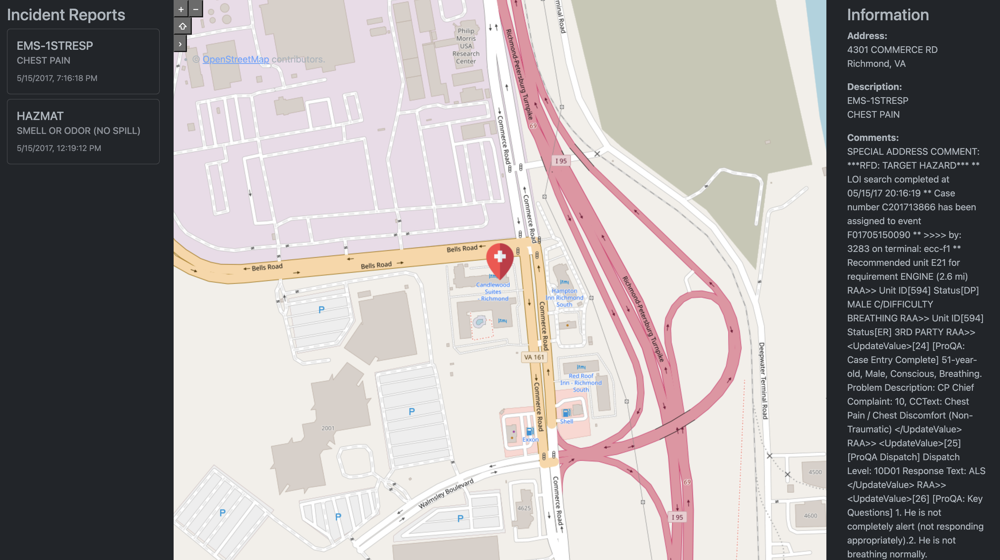

# Incident Report Take Home Project

This repo contains the completed project for the take home recruiting assignment.  In essence this project takes data from a 911 incident and overlays it onto a map.  The map also contains the weather information for the date and time of the incident.

Project Stack
- JavaScript
- React
- Google Map API
- Metrostat API

## Getting Started
To get started, download this repo and run the commands below.

1. `npm install`
2. `npm run dev`

This will install all of the needed dependencies and run the app in the dev mode.

If you want to use a different data source, then replace the contents of the `/src/data/reports.json` file.  Currently this app will only work with one report.

## Improvements
If I had more time, I would have worked on multiple reports and listing them in a menu.  The user could then click on the report they wanted to see and the map would refresh with that report's data.  I would have also liked to add more details in a better format to each of the map pins.

## Time Spent
I spent around 7-8 hours on this project.  I started to go in one direction, and then found myself at a road block.  After trouble shooting for a while, I decided to go another direction which required some refactoring.  In the end, I was able to get the app to a functional state, but I would have liked to have made it more detailed.

## Additional Screenshot

