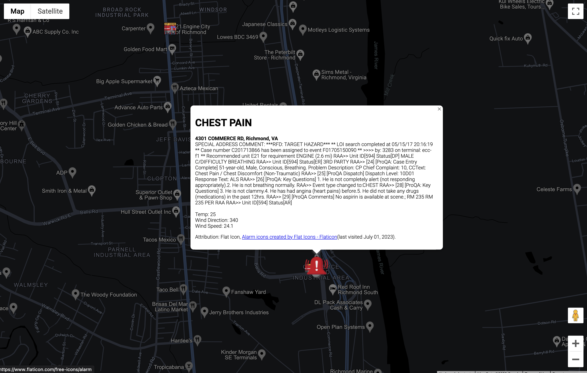

# Incident Report Take Home Project

This repo contains the completed project for the take home recruiting assignment.  In essence this project takes data from a 911 incident and overlays it onto a map.  The map also contains the weather information for the date and time of the incident.

Project Stack
- JavaScript
- React
- OpenLayers API
- Open-Meteo API

## Getting Started
To get started, download this repo and run the commands below.

1. `npm install`
2. `npm run dev`

This will install all of the needed dependencies and run the app in the dev mode.

If you want to use a different data source, then replace the contents of the `/src/data/reports.json` file.

## Improvements
Some improvements I would like to make is listing each individual response vehicle with markers, information, and move the map when the info card is clicked.  Another improvement is to have an information window open when a pin is clicked with more information about that item of the report.

## Time Spent
I spent around 7-8 hours on this project.  I created this project first using Google Maps and RapidAPI, but decided to remove both and replace them with OpenLayers and Open-Meteo for the map and the weather respectivly.  I also changed the general layout and updated it so multiple records are shown.

## Additional Screenshot

